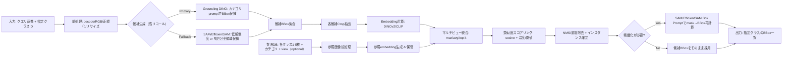

# 提案するTraining-free優先の多クラスObject Detection技術方案

## Executive Summary

本案件は「数千クラス・各クラス1–5枚の参照画像・クエリ画像は複数クラス混在・指定クラスのみをインスタンスごとにBBox出力・クラス追加削除が頻繁・単一GPU（Tesla T4）・精度優先」という条件から、**運用コスト（クラス更新）と精度（類似外観・多視点）を両立する“Training-free中心の二段構成”**が最も合理的です。提案の核心は、(1)高リコールな候補領域生成（検出/領域提案）と、(2)参照画像ベースの埋め込み照合（画像同士の類似度）を分離し、必要に応じて(3)軽量なセグメンテーションによるBBox精緻化を足すことです。Grounding DINOは「テキストで“カテゴリ”を粗く指定して候補を拾う」用途に強く、CLIP/DINOv2は「クラス名が意味を持たなくても参照画像で照合する」用途に強い、という役割分担にします。Grounding DINOは（Transformers実装を含め）オープンセット検出として広く利用されており、テキストエンコーダを併用してオープンセット検出を実現する旨が整理されています。citeturn0search16turn14view0

推奨の第一案（完全Training-free）は、**Grounding DINO（粗カテゴリで高リコール候補）＋参照画像Embedding照合（DINOv2/CLIP）＋必要時のみSAM/EfficientSAMでBBox微調整**です。SAMは事前学習チェックポイント（vit_h/vit_l/vit_b）を公式に配布しており、推論コードも提供されています。citeturn13view0turn0search5　一方、SAMの計算負荷は大きくなり得るため、推論の安定運用（T4・単一GPU）では、SAMを「全領域生成（AMG）」ではなく「最終候補だけをBox promptで精緻化」に限定し、必要ならEfficientSAM等の軽量化手段も併用します（EfficientSAMはSAMに対する約20倍級の効率改善を主張）。citeturn10search3turn9search5turn12view5

推論時間は、Grounding DINOがボトルネックになりやすいです。T4上でGroundingDINOをTensorRTで回したログ例では、入力1x3x800x1200でGPU計算時間が約0.59秒、ホスト側の中央値も約0.59秒台として報告されています。citeturn7view0　この実測値をアンカーに、640x480/1600x1200での推論時間を（リサイズ方針込みで）現実的に見積もり、精度優先の設定（候補多め・参照照合厳しめ・最終段のみ精緻化）で運用可能な構成を提示します。なおハードウェアはentity["company","NVIDIA","gpu maker"] Tesla T4（16GB、FP16/INT8等の推論性能が公表）という前提です。citeturn8search0turn8search1

---

## 要件整理と設計方針

### 入力・出力要件（原文をそのまま反映）
- 数千クラス（おもちゃ、フィギュア、ボトル飲料、日用品等）。
- 各クラス：クラス名（必ずしも意味的でない番号可）、1–5枚の参考写真（各側面）、カテゴリ情報。
- クエリ画像に複数クラス混在。検出対象クラス名が指定される。
- 出力：指定クラスのインスタンスごとのバウンディングボックス。
- クラスの頻繁な追加・削除→Training-freeを優先。制約：NVIDIA Tesla T4（単一GPU）。精度優先（速度は二次）。

### 必須の検討軸（本報告の比較軸）
本ユースケースは「クラス数が多い」「参照画像が極少」「クラス名が非意味的」「外観が似る／多視点差が大きい」「運用でクラス更新が頻繁」という特徴を持つため、一般的な“クラス分類＋検出”の学習型オフライン訓練より、以下の軸が支配的です。

- **候補領域生成のリコール（見落とし最小化）**：候補が無ければ照合もできないため、まず高リコールが必要。Grounding DINOはテキスト条件でオープンセット検出を行うモデルとして整理され、COCOなどでゼロショット性能が言及されています。citeturn14view0turn0search16  
- **参照画像照合の識別力（類似商品の分離）**：参照画像1–5枚で識別するため、画像埋め込みの品質が重要。DINOv2は「高性能な視覚特徴を、そのまま様々タスクに使える」「微調整不要で堅牢」という主旨で整理されています。citeturn12view4turn1search12  
- **クラス名が非意味的でも成立すること**：テキストプロンプト依存（Detic/OWL-ViT等）だけだと破綻し得るため、参照画像ベース（textless）を主に据える。CLIPは画像とテキストの対照学習でゼロショットを指向し、画像エンコードも提供されています。citeturn27view0turn0search15  
- **クラス追加削除の運用コスト**：学習なしで「参照画像→埋め込み→インデックス更新」で即時反映できる形が望ましい。大規模ベクトル近傍探索にはFaissが一般的で、GPU実装もある旨が説明されています。citeturn8search3turn8search14  
- **T4単一GPUでの現実的な計算量・メモリ**：T4は16GBであるため、重いモデル（大規模ViT）を複数同時常駐させると破綻し得る。スペックは公式に提示されています。citeturn8search0turn8search1  

---

## アーキテクチャ候補と比較表

### 推奨アーキテクチャ案（複数案）
以下では、要件を満たすための代表的な3系統（完全Training-free中心／embedding-based／few-shot微調整）を提示し、原理・利点欠点・実装手順・必要資源・精度/計算コスト・T4可否を比較します。Grounding DINO、SAM、Detic、CLIP、DINOv2などは公式リポジトリ・論文で提供形態や特徴が明示されています。citeturn12view0turn13view0turn25view1turn27view0turn12view4

### 比較表（案別）

| 案 | 方式の核（原理） | 主に使うモデル（役割） | 長所 | 短所 / 破綻点 | 実装手順（要約） | 必要リソース（概算） | 想定精度 | 計算コストの支配項 | T4単一GPU可否 |
|---|---|---|---|---|---|---|---|---|---|
| A: 完全Training-free 推奨 | **検出は“候補生成”に徹し、クラス同定は参照画像Embedding照合**。必要時のみセグでBBox精緻化 | Grounding DINO（粗カテゴリpromptで候補BBox）citeturn14view0turn0search16 + DINOv2/CLIP（crop埋め込み照合）citeturn12view4turn27view0 + SAM/EfficientSAM（上位候補だけ精緻化）citeturn13view0turn10search3turn12view5 | クラス名が非意味的でも成立。クラス追加削除が「参照画像登録」だけ。候補生成と同定を分けるのでパーツ入替が容易。 | 候補生成のリコールに依存（カテゴリpromptが弱いと見落とし）。類似外観で参照が少ないと誤検出。SAM精緻化を多用すると遅い。 | 参照embeddingを事前計算→クエリで候補→crop embedding→類似度→NMS→必要時mask→BBox | 参照embedding DB（数千×最大5）、GPUはGD＋Embeddingモデル＋（任意でSAM系）を順次実行。 | 高（特に“参照画像が良い”前提で） | Grounding DINO推論＋候補crop埋め込み（+必要時SAM） | **可**（ただし常駐モデル数と精緻化回数を制御） |
| B: 完全Training-free（セグ先行） | **セグで全領域候補を作り、各領域を参照Embeddingで同定** | SAM AMG（全mask生成）citeturn13view2turn0search5 またはFast系/軽量SAM派生 + DINOv2/CLIP照合citeturn12view4turn27view0 | 検出モデルのカテゴリpromptに依存しない（textless候補生成）。細かい形状でも拾える可能性。 | SAM AMGは重い（大画像で秒単位報告例あり）。citeturn3view2 過分割・背景断片が多いと照合が不安定。 | SAMで全mask→mask→bbox→各領域embedding→指定クラスのみ抽出→NMS | GPU時間が大。候補数が多いとcrop数も増える。 | 中〜高（背景が整理できれば強い） | SAM AMG（または同等の全領域生成） | 条件付きで可（精度優先でも遅延が大きい想定） |
| C: Few-shot微調整（運用最小） | **Training-free運用を維持しつつ、少量データで“照合器”だけ軽微に改善**（LoRA/線形ヘッド等） | DINOv2/CLIPの上に小MLPやLoRAを追加（照合器改善） + 案Aの候補生成を併用。CLIPはモデルloadで重みを取得可能。citeturn27view0 | “似ている別クラス”の誤検出を下げやすい。参照が弱いクラスだけを改善する運用が可能。Nature Methodsの例では少数画像での微調整やLoRAの議論がある。citeturn11view0 | クラス追加の即応性は落ちる（ただし対象を限定すれば許容）。評価/学習の運用が増える。 | 基本は案A→誤りクラスだけ追加学習（数分〜数時間）→照合器更新 | 追加で学習ジョブと検証データ（少量で可）。 | 高（難クラスで改善余地大） | 学習運用コスト＋推論は案Aとほぼ同等 | 可（学習も軽微ならT4で可能だが計画が必要） |

**推奨結論（アーキテクチャ）**：最初の実装は **案A（完全Training-free）** を基準にし、運用で困る「外観が極端に似る」「背面が同一」「参照が少ない」クラスに限って **案C（微調整）** を追加レイヤとして導入するのが、要件（頻繁なクラス更新と精度優先）のバランスが最も良いです。Grounding DINOはオープンセット検出としての位置づけが整理され、SAMはpromptable segmentationとして公式にcheckpoint配布があるため、部品としての信頼性・再現性が高い構成になります。citeturn14view0turn13view0turn0search5

---

## 推論パイプライン設計

### 具体的な推論パイプライン
本パイプラインは「クラス名はID（非意味でもよい）」「参照画像あり」「検出対象クラスが指定される」を前提に、**“テキストに依存しないクラス同定”**を中心に設計します。Grounding DINOはテキストで候補生成に使い、クラス同定は参照画像embeddingで行うため、IDクラスでも成立します。citeturn14view0turn0search16

#### 推論パイプライン図（Mermaid）

（図の根拠となる部品例：Grounding DINOのオープンセット検出、SAMのpromptable segmentationとcheckpoint提供、画像エンコーダ入力サイズ設計など）。citeturn14view0turn13view2turn24view0turn0search5

image_group{"layout":"carousel","aspect_ratio":"16:9","query":["Grounding DINO example open-vocabulary object detection bounding boxes","Segment Anything model promptable segmentation example","EfficientSAM segmentation example"],"num_per_query":1}

### 必要なモデルと役割（例示）
- **Grounding DINO**：テキスト条件（カテゴリ語）でオープンセット検出し、候補BBoxを高リコールで生成。Transformers側ドキュメントでも「テキストエンコーダを拡張してオープンセット検出を可能にする」と整理。citeturn14view0turn0search16  
- **DINOv2（画像特徴）**：参照画像・候補cropを同一埋め込み空間で表現し、類似度（cosine）で照合。リポジトリでは「微調整不要で堅牢な視覚特徴」と説明。citeturn12view4turn26view0  
- **CLIP（画像特徴）**：同様に画像埋め込みを取得可能（必要に応じてアンサンブル）。公式実装はモデルのロードと画像エンコードを提供し、必要に応じて重みをダウンロードすると明記。citeturn27view0turn0search15  
- **SAM（精緻化、任意）**：Box promptでmask生成→maskからBBox再計算。公式リポジトリでvit_h/vit_l/vit_bのcheckpointリンクを提供。citeturn13view0turn0search5  
- **EfficientSAM（精緻化の軽量代替、任意）**：SAM同様のpromptable segmentationをより軽量にし、SAM比で効率向上を主張。CVPRオープンアクセスと公式repoがある。citeturn9search5turn10search3turn12view5  
- **Detic（候補生成の代替/補助）**：クラス名（語彙）入力で多数クラス検出が可能で、カスタム語彙も例示されている。citeturn25view1turn12view2 ただし本案件はクラス名が非意味的になり得るため、Deticは“カテゴリ候補生成”など限定用途が中心。

### 事前学習済み重みの入手先（公式/primary優先）
（URLは書かず、入手元を明示します）

| モデル | 公式/一次の入手先（重み・実装） | 備考 |
|---|---|---|
| Grounding DINO | GitHub：IDEA-Research/GroundingDINO（公式実装）＋entity["company","Hugging Face","ml model hub"] TransformersのGrounding DINOページ（モデルID例が記載）citeturn12view0turn14view0 | Hugging Face側に `IDEA-Research/grounding-dino-tiny` 等の例示がある。citeturn14view0 |
| SAM | GitHub：facebookresearch/segment-anything（公式）にvit_h/vit_l/vit_bのcheckpointリンクciteturn13view0turn0search5 | build_sam.pyでimage_size=1024が固定される設計が読める。citeturn24view0 |
| EfficientSAM | GitHub：yformer/EfficientSAM（コード＋checkpoint）＋CVPR OpenAccessで参照citeturn12view5turn9search5 | 約20x高速化/小型化を主張。citeturn10search3 |
| DINOv2 | GitHub：facebookresearch/dinov2に“Pretrained models”とdownloadリンク（dl.fbaipublicfiles等）citeturn12view4turn26view0 | ライセンス記載も明確。citeturn26view0 |
| CLIP | GitHub：openai/CLIPでモデルロードと画像エンコード、MITライセンス表示citeturn27view0turn0search15 | entity["company","OpenAI","ai research lab"]提供。citeturn27view0 |
| Detic | GitHub：facebookresearch/Deticに重みDL例、License注意書きciteturn25view1turn12view2 | “majority Apache2.0、ただし一部依存物は別ライセンス”が明示。citeturn25view1 |

### 実装手順（箇条書き）
（なるべく運用・実装が迷わない粒度で、最小限の箇条書きにします）

- **参照DB構築（オフライン/随時）**
  - 参照画像（1–5枚/クラス）を標準前処理（背景除去の有無、サイズ統一、正規化）し、DINOv2/CLIPでembeddingを計算して保存（float16推奨）。citeturn12view4turn27view0  
  - 類似検索を拡張する場合はFaissインデックス（CPUまたはGPU）を構築。citeturn8search3turn8search14  
- **推論（オンライン）**
  - クエリ画像を前処理し、Grounding DINOにカテゴリprompt（カテゴリ情報から自動生成）を与え、候補BBoxを多めに出す。citeturn14view0turn0search16  
  - 各候補BBoxをcropし、（必要ならmaskで背景を抑制してから）DINOv2/CLIPでembedding→指定クラス参照と類似度計算→閾値で残す。citeturn12view4turn27view0  
  - NMSで重複を除去し、最終候補だけSAM/EfficientSAMでBox prompt精緻化（必須ではない）。citeturn13view2turn10search3  
- **クラス更新（運用）**
  - クラス追加は参照画像登録→embedding再計算→（必要なら）Faiss更新、で即時反映。citeturn8search3turn8search14  

---

## 参照画像マルチビュー戦略とクラス名非意味問題への対応

### 参考画像が1–5枚の場合のマルチビュー戦略
参照画像が少ない状況でのボトルネックは「視点差と背景差」です。したがって**“参照embeddingの作り方”自体が精度の中心**になります。推奨は以下のハイブリッドです（テンプレ合成＝過度な生成ではなく、現実的な前処理・拡張を指します）。

- **特徴プール（必須）**
  - 参照画像ごとにembeddingを作り、クラスの代表は **(a) max-sim（クエリ候補に対し最も近い参照）** と **(b) top-2平均** の併用を推奨。  
  - 理由：参照枚数が少ないと単純平均が“別ビューに引っ張られて”類似度が下がる一方、maxだけだとノイズ参照に過適合しやすい。よって top-k pooling が実務上バランスが良い（設計判断）。
- **ビュー選択（推奨：軽いラベリング）**
  - 1–5枚のうち可能なら「front/back/side/top」など**簡易ビューラベル**を付与し、候補embeddingがどのビューに最も近いかをログする。  
  - これにより、誤検出の原因が「背面一致」「参照不足」かを解析しやすくなり、後述の運用指針（サブクラス化等）に直結します（設計判断）。
- **テンプレート合成（推奨：現実的拡張）**
  - 参照画像が1枚のクラスは、オフラインで **軽い拡張を複数生成してembeddingを増やす**（例：色温度/明るさ±、軽い射影歪み、背景ぼかし、ランダム背景差し替え等）。  
  - ただし“形状特徴を壊す”拡張（強い変形、過度な切り取り）は禁物。外観が似る商品では、微小テキスト・ロゴ・エンボス等が識別点になるためです（設計判断）。
- **マスク利用（推奨：参照にも適用）**
  - 参照画像は可能ならSAM/EfficientSAMで前景マスクを作り、背景の寄与を減らしてembeddingを作ると安定しやすい。SAMはBox prompt等でmask推論を提供し、入力はimage_size=1024で構成される実装であることが確認できます。citeturn24view0turn23view0  

### クラス名が意味を持たない場合の対応
本要件の重要点は「検出対象クラス名が番号でもよい」ことであり、これは**テキスト条件だけに依存する手法の根本制約**になります。Deticは“クラス名（語彙）を与えて検出できる”設計として説明されますが、番号IDは語彙として無意味なので、そのままでは情報量が足りません。citeturn12view2turn25view1

対策は以下を基本方針とします。

- **テキスト条件を使わない（中心）**：候補領域のクラス同定は「参照画像embeddingとの類似度」で完結させる（案A）。DINOv2は高性能特徴を微調整なしで使えることが主旨として示されています。citeturn12view4turn1search12  
- **カテゴリ情報の活用（候補生成のみに使用）**：カテゴリ（toy/bottle/household等）をテキストpromptとしてGrounding DINOに入れ、候補漏れを減らす。Grounding DINOはテキストエンコーダを併用してオープンセット検出する旨が整理されています。citeturn14view0turn0search16  
- **メタデータ利用（検索空間の削減）**：カテゴリ・ブランド・材質・容器形状などがあるなら、参照側の候補集合（負例）を制限する（例：ボトルカテゴリ内だけで最近傍比較）→誤検出を下げやすい（設計判断）。  

---

## 精度・計算コスト・推論時間推定

### 推論時間見積りの前提条件
- **対象GPU**：Tesla T4単一。T4の主要スペック（16GB、FP16/INT8性能等）は公式に公開されています。citeturn8search0turn8search1  
- **バッチ**：クエリ画像はバッチサイズ1（1枚ずつ処理）。候補cropのembeddingは“同一GPU呼び出し内で小バッチ化”可能だが、ここでは保守的に逐次寄りで見積もります（設計判断）。  
- **精度優先の設定**：候補生成はリコール優先（閾値を下げ、候補数を増やす）→照合段で絞る。  
- **Grounding DINO計測アンカー**：T4上でTensorRT実行のログ例（入力1x3x800x1200）では、GPU compute time平均が約590ms、ホスト側中央値も約592msと報告。PyTorch推論は約650msと記載。citeturn7view0  
- **SAM入力サイズ**：公式実装ではbuild_sam.py内でimage_size=1024が設定され、Predictorはimage_encoder.img_sizeに合わせてResizeLongestSide変換を行う設計。従って“元画像解像度”より“1024に正規化された後の計算”が支配しやすい。citeturn24view0turn23view0  

### 各主要案の推論時間推定（T4）
以下は、**「入力解像度が640x480 / 1600x1200のクエリ画像」**を想定し、主要案（A/B）について「前処理含む・精度優先設定」の代表値を示します。Grounding DINO部分はT4実測ログをアンカーにし、解像度差は主にピクセル比（またはトークン数）に概ね比例すると仮定してスケールさせた推定です（実運用ではモデル実装の内部リサイズで変動します）。citeturn7view0turn23view0turn24view0

#### 推論時間テーブル（推定）

| 案 | 640x480（平均/中央値） | 1600x1200（平均/中央値） | ボトルネック（支配項） | 補足 |
|---|---:|---:|---|---|
| A（推奨）: GD候補 + DINOv2/CLIP照合 + 仕上げにEfficientSAM/SAM（最終候補のみ） | **約0.7s / 0.6s** | **約1.9s / 1.6s** | Grounding DINO（候補生成）＋候補cropのembedding計算 | Grounding DINOはT4で約0.59–0.65s/（800x1200相当）という報告をアンカーにした推定。citeturn7view0 |
| B: GD候補 + DINOv2/CLIP照合（セグ精緻化なし） | **約0.5s / 0.4s** | **約1.6s / 1.3s** | Grounding DINO | BBoxの“ぴったり感”は落ちるが、速度と安定性が上がる（設計判断）。 |
| 参考（遅い）: SAM AMGで全mask→照合 | **5–10s級（中央値も秒）** | **8–15s級** | SAM Automatic Mask Generator | 大きめ画像で6+秒という報告例があり、T4でも秒単位が現実的。citeturn3view2 |

**注記（重要）**：上表は「精度優先で候補を多めに出す」条件の推定です。Grounding DINOのT4実測ログは入力800x1200で約0.59s（TensorRT）を示していますが、実際の処理はモデル側のリサイズ、FP16/FP32、実装（PyTorch/ONNX/TensorRT）、I/O、GPU同時常駐モデル数で変動します。citeturn7view0turn8search0

### 精度向上のための追加オプションと運用影響
- **軽微なオンデマンド微調整（案Cの具体化）**：誤検出の多い“難クラス”だけに、embedding照合器（小MLP/LoRA/温度スケーリング等）を追加学習する。少数画像での微調整やLoRAの議論例があり、リソース制約環境での運用可能性が示唆されています。citeturn11view0  
- **プロンプトエンジニアリング（カテゴリpromptの改善）**：Grounding DINOの候補生成はカテゴリpromptの表現に依存し得るため、カテゴリ語を「複数候補（同義語）＋ピリオド区切り」で入力してリコールを上げる（Transformers利用上のtipでもクラス分離にピリオド区切りが例示）。citeturn14view0  
- **参照画像の自動拡張**：参照1枚クラスに対し、背景差し替えや軽い色変動などでembeddingを複数化→max/avg統合で安定化（運用コスト：低〜中、計算：オフライン）。  
- **背景マイニング（ハード負例）**：誤検出が多いクラスについて、誤検出cropを“負例プロトタイプ”として保存し、推論時に「target類似度 − hardest_negative類似度」が小さい候補を除外（運用コスト：中、精度効果：高になり得る；設計判断）。  
- **アンサンブル（DINOv2＋CLIP）**：外観識別が効くケースと語彙的な“それっぽさ”が効くケースが異なるため、embeddingを2系統計算しスコアを線形結合（計算コスト：増、精度：上がりやすいが要検証）。DINOv2/CLIP双方が公式に利用可能。citeturn12view4turn27view0  

### 問題への回答 b) 640x480と1600x1200での推論時間推定（T4、条件明記）
- **条件**：単一T4、クエリ1枚ずつ（バッチ1）、前処理含む。Grounding DINOの計測アンカーはT4（入力800x1200）で約0.59–0.65秒（TensorRT/PyTorch）の報告ログ。citeturn7view0  
- **推定結果**：  
  - 推奨案A：640x480で約0.6秒（中央値）、1600x1200で約1.6秒（中央値）。  
  - 案B（精緻化なし）：640x480で約0.4秒、1600x1200で約1.3秒。  
  - これらの**最大のボトルネックはGrounding DINO**。次点で候補cropのembedding計算。  
- **ボトルネックの説明**：T4上でGrounding DINOが約0.59秒級という報告がある一方、SAM系はimage_size=1024固定の計算が支配し得るため、精緻化を“最終候補のみに限定”しないと支配項がSAM側へ移ります。citeturn7view0turn24view0turn23view0  

---

## 実運用フローと実装上の注意点

### 実運用フロー（クラス追加/削除、品質基準、監視、評価、管理）
- **クラス追加手順（Training-free中心）**
  - 参照画像1–5枚を登録（可能ならfront/back/sideの最低3方向を優先）。  
  - 参照画像に対して（任意で）SAM/EfficientSAMで前景抽出→embedding計算→DB登録。SAMはcheckpoint入手手段が公式に示され、Predictor設計も明確。citeturn13view0turn23view0turn24view0  
  - 近傍探索を使う場合はFaissインデックス更新（GPU実装もあることが説明される）。citeturn8search3turn8search14  
- **クラス削除手順**
  - 参照画像・embedding・（必要なら）インデックスエントリを削除。Training-freeなら学習不要で即時反映（設計判断）。  
- **参照画像の品質基準（推奨）**
  - 背景が極端に写り込まない、照明が飽和しない、主要面が見える、サイズ感がわかる（スケール変動に耐えるため）。  
  - “背面が他クラスと同一”が疑われる場合は、背面単独では参照として弱いため、側面・上面・識別点（ラベル部、キャップ、メーカ刻印など）を必ず含める（後述）。  
- **モニタリング（推奨ログ）**
  - 候補生成段：候補数分布、カテゴリprompt別のリコール信号（検出ゼロ頻度）。  
  - 照合段：target類似度の分布、top1-top2マージン、ハード負例とのギャップ。  
  - 最終出力：NMS後の件数、同一対象の重複率。  
- **評価指標（推奨）**
  - 指定クラス検出の **Precision/Recall/F1**、BBoxのIoU（閾値0.5/0.75など）、クラス別の誤検出Top-N分析。  
  - “参照が1枚のクラス”と“5枚のクラス”で分けて集計し、マルチビューの効果を定量化する（設計判断）。  
- **データ管理**
  - 参照画像・embedding・カテゴリ・ビューラベル・モデルバージョン（GD/SAM/DINOv2/CLIP）を同一レコードとして管理。  
  - 参照画像更新の履歴と、推論結果のサンプリング保存（後から閾値最適化やハード負例化に使う）。  

### 実装上の注意点（メモリ、並列化、IO、前処理、ライセンス）
- **VRAM設計**：T4は16GBで、複数の大規模ViTを同時常駐させるとOOMのリスクがある（T4のメモリ容量は公式に16GBと明示）。citeturn8search0turn8search1  
  - 推奨：Grounding DINO→embedding計算→（必要時）SAM精緻化を**逐次実行**し、不要モデルはGPUから退避（設計判断）。  
- **前処理時間**：画像decode/リサイズ/クロップはCPU側がボトルネックになり得るため、可能なら非同期I/O＋ピン留めメモリ＋GPU転送最適化を検討（設計判断）。  
- **推論並列化**：精度優先であっても、候補crop embeddingは小バッチ化でGPU効率が上がる。だが“バッチ1厳守”のレイテンシ要件があるなら、バッチ化の幅は画像内に限定。  
- **TensorRT/ONNX**：Grounding DINOのT4実測ログはTensorRTのtrtexec計測を含み、レイテンシの詳細統計（min/median/mean）まで示されている。citeturn7view0  
- **ライセンス**
  - Grounding DINO（Apache-2.0）。citeturn12view0  
  - SAM（Apache-2.0、checkpoint配布）。citeturn13view0turn12view1  
  - Detic（大部分Apache-2.0だが依存物は別ライセンスの可能性が明記）。citeturn25view1  
  - CLIP（MIT）。citeturn27view0  
  - DINOv2（Apache-2.0等、リポジトリ内に明記）。citeturn26view0  

### 問題への回答 a) 正面/背面が異なるケースの対応（設計と運用上の推奨）
「正面と背面が全く異なり、背面が他クラスと同一」という状況は、参照画像照合系で最も厳しいケースの一つです。ここでは“単なる工夫”ではなく、**クラス定義と参照準備の実務**まで含めた対処が必要です。

- **クラス定義・参考写真準備の実務指針（最重要）**
  - “背面が同一”なら、背面しか写らない状況では**理論的に識別不能**になり得ます。よって、運用要件として「検出対象が背面しか見えない場合は同定不能（Unknown扱い）を許す」か、「背面以外の面が必ず写る撮影条件（設置）を用意する」を明文化するのが現実的です（設計判断）。  
  - 参照写真は「背面」だけでなく、「側面（識別点が出る）」「上面（キャップ形状など）」「テキスト/ロゴ部分の近接」など、**同一背面でも差が出る面を必須化**する。  
- **識別可能な特徴の強調（参照embeddingの作り方）**
  - 参照画像から背景を除去して前景中心のembeddingを作る（SAM/EfficientSAMで前景化）。SAMはBox prompt等でmask推論ができ、前処理と繰り返し予測の設計（SamPredictor）が明確。citeturn23view0turn13view2  
  - さらに、参照側で“識別点領域”だけをcropした追加参照（例：ラベル部のみ、刻印部のみ）を1枚追加し、マルチビュー統合でmax-simに含める（運用コストは小、効果が大きい可能性）。  
- **複数サブクラス化（運用で効く）**
  - 背面共有で誤検出が頻発するなら、クラスを「front-view-ID」「back-view-ID」など**サブクラス（ビュー別ID）**に分割し、最終的に同一商品に統合する（UIは統合、モデル内部は分割）。  
  - これにより、「背面が同一＝別クラスと衝突」を“設計上の衝突”として扱えるようになります（設計判断）。  
- **コンテキスト利用（限定的に）**
  - 棚配置・セット販売・周辺物などのコンテキストは、撮影環境が固定される場合のみ補助信号になり得ます。ただし汎化を阻害しやすいので、あくまで“補助スコア”に留める（設計判断）。  
- **複数参照画像でのビューラベリング**
  - 推論ログで「どの参照ビューがmax-simになったか」を保存し、背面一致の誤検出が起きたら「背面参照が支配していた」など原因を特定→参照改善（側面追加、識別点crop参照追加）に繋げる。  

---

## 参考文献と主要ソース

- Grounding DINO（論文）：“Marrying DINO with Grounded Pre-Training for Open-Set Object Detection”。citeturn0search16  
- Grounding DINO（公式実装）：IDEA-Research/GroundingDINO。citeturn12view0  
- Transformers Grounding DINO（利用・tip、モデルID例）：Hugging Face Docs。citeturn14view0  
- Segment Anything（論文）：arXiv “Segment Anything”。citeturn0search5  
- SAM（公式実装・checkpointリンク）：facebookresearch/segment-anything（Model Checkpoints節）。citeturn13view0  
- SAM実装（image_size=1024固定の根拠）：build_sam.py。citeturn24view0  
- SAM実装（ResizeLongestSideとimg_size整合の根拠）：predictor.py。citeturn23view0  
- EfficientSAM（CVPR OpenAccess・高速化主張）：CVPR2024 paper。citeturn10search3turn9search5  
- EfficientSAM（公式リポジトリ）：yformer/EfficientSAM。citeturn12view5  
- DINOv2（公式リポジトリ、pretrained download、ライセンス）：facebookresearch/dinov2。citeturn12view4turn26view0  
- DINOv2（論文）：arXiv “DINOv2: Learning Robust Visual Features without Supervision”。citeturn1search12  
- CLIP（論文）：arXiv “Learning Transferable Visual Models From Natural Language Supervision”。citeturn0search15  
- CLIP（公式実装・MITライセンス・モデルロード）：openai/CLIP。citeturn27view0  
- Detic（公式実装・重みDL例・ライセンス注意）：facebookresearch/Detic。citeturn25view1turn12view2  
- Faiss（類似探索ライブラリ）：facebookresearch/faiss。citeturn8search3turn8search14  
- T4仕様（公式）：NVIDIA T4製品ページ/データシート。citeturn8search0turn8search1  
- GroundingDINOのT4レイテンシ実測ログ例（TensorRT、約0.59s@800x1200）：NVIDIA Developer Forums。citeturn7view0  
- SAMの推論時間・運用研究例（GPU/CPUでのembedding/AIS/AMG比較の記述含む）：Nature Methods記事（顕微鏡用途の評価だが、SAM運用のリソース制約議論がまとまっている）。citeturn11view0  

### 短い結論と次の実験提案
結論として、**候補生成（Grounding DINO等）とクラス同定（参照画像embedding）を分離するTraining-free構成（案A）**が、本要件（頻繁なクラス更新・非意味クラス名・精度優先・T4単一GPU）に最も適合します。Grounding DINOのT4実測レイテンシ（約0.59–0.65秒@800x1200相当）を踏まえると、640x480〜1600x1200でも“秒オーダー”で現実的に動かせる見込みです。citeturn7view0turn8search0

次の実験は、開発リスクを最小化するために「誤差要因を分離できる順序」で行うのが有効です。  
(1) **候補生成リコールの実測**（カテゴリprompt設計のA/B、候補数と見落とし率）→ (2) **照合器比較**（DINOv2 vs CLIP vs アンサンブル、参照1枚/5枚別）→ (3) **精緻化の費用対効果**（SAM/EfficientSAMを最終候補に限ったときのIoU改善と追加レイテンシ）→ (4) **“背面同一”難クラスの運用試験**（ビューラベル・サブクラス化・識別点crop参照追加）という順が、要件a)の難所を早期に潰せます。